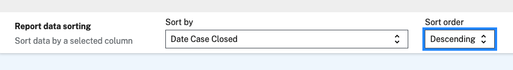
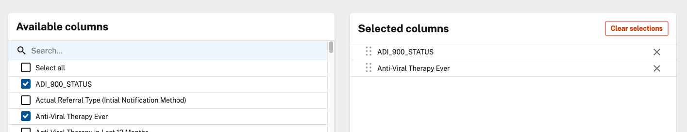

# Custom Python NBS Report Libraries

## Table of Contents

- [Intro](#intro)
- [Concepts](#concepts)
  - [Report](#report)
  - [Report Library](#report-library)
  - [Python Library](#python-library)
- [Example Python Library](#example-python-library)
- [Adding a Custom Library to NBS](#adding-a-custom-library-to-nbs)
  - [Adding a Brand New Python Library](#adding-a-brand-new-python-library)
  - [Replacing an Existing SAS Library With Python](#replacing-an-existing-sas-library-with-python)
  - [Deploying Custom Python Libraries](#deploying-custom-python-libraries)
    - [Using a ConfigMap](#using-a-configmap)
- [Running the New Report Library](#running-the-new-report-library)
  - [Creating a Report With the New Python Library](#creating-a-report-with-the-new-python-library)
  - [Accessing a Report That Was Updated From SAS to Python](#accessing-a-report-that-was-updated-from-sas-to-python)
- [Advanced Topics](#advanced-topics)
  - [Library Params](#library-params)

## Intro

In NBS 6, SAS was used to allow STLTs to write custom report libraries. In NBS 7, SAS has been phased out in favor of running report libraries using Python. These Python libraries will be able to query existing databases and return results for viewing in the NBS 7 UI or to be exported to CSV files.

These new Python libraries will be executed by the Report Execution service which can be found in the `NEDSS-Modernization` repository:

[NEDSS-Modernization](https://github.com/CDCgov/NEDSS-Modernization)

Within the repository the Report Execution service is found at `app/report-execution` and the Python library files themselves are located at:

```
apps/report-execution/src/libraries        # builtin libraries
apps/report-execution/src/libraries/custom # STLT-made custom libraries
```

## Concepts

### Report

A report is the main entity which is used to run individual report libraries (previously written in SAS, now written in Python) using a configured data source in NBS.

### Report Library

Where the actual data lookup and handling logic of the report lives.  In NBS 7 the report libraries are Python files which adhere to a prescribed shape in order to be used in NBS via the Report Execution app.

A Report Library can either be:

- builtin: pre-built report libraries that are maintained by NBS devs
- custom: report libraries built by STLTs and used only within their NBS install

### Python Library

A single Python file that adheres to a prescribed shape (see example below) that is called when a report is run from NBS via the Report Execution app.

## Example Python Library

Here is a simple example of a Python library which returns unmodified data queried from a given data source:

```Python
from src.db_transaction import Transaction
from src.models import ReportResult, Table


def execute(
    trx: Transaction,
    subset_query: str,
    **kwargs,
) -> ReportResult:
    """Simple example of a Python Report Library."""

    content: Table = trx.query(subset_query)

    return ReportResult(content=content)
```

- `execute` is the entrypoint for all Python libraries and is how the Report Execution app calls each Python library
- `subset_query` is the SQL query that is given to the library by NBS to act as the main data source for the report (**NOTE:** all column selections, filters, and security permissions are already baked into the query that is passed in here)
- `Transaction` represents the database connection and has a method named `query` to execute SQL queries (results returned in a `Table` instance)
- `Table` is the data format which contains both column names and data which is used to return the result to NBS
- `ReportResult` is the data shape that is used to return the report's resulting data (via a `Table` instance, assigned to the `content` attribute) to either the NBS UI or the exported CSV

A note on the `**kwargs` parameter in the above example.  There are several additional parameters that are passed in by the Report Execution app when calling the `execute` method on a given library.  These are:

- `trx` - already included in example
- `subset_query` - already included in example
- `sort_by` - when running a report from the NBS UI you may select a column to sort by and this will be passed in as a valid SQL string for use in an `ORDER BY` statement.  For instance the choice shown in the following image will be passed in the `sort_by` parameter with the value `[Date Case Closed] DESC`:
  
- `days_value` - this is a builtin specific value for the `Duplicate Investigations Time Frame` report filter.  If you are converting an existing SAS report which uses this specific report filter you may access it through the `days_value` function parameter.
- `column_map` - when specific columns are selected in the NBS run report UI, this parameter is built with each column's `column name` (its actual SQL column name) and `column title` (the more human-friendly string describing the column) mapped to one another in a list.  For example if you selected the columns in the UI shown in the following picture:
  
   the `column_map` value would then be `[['ADI_900_STATUS', 'ADI_900_STATUS'], ['HIV_AV_THERAPY_EVER_IND', 'Anti-Viral Therapy Ever']]`
- `library_params` - explained in the "Advanced Topics" section of this document
 

**Note**: _always_ include the `**kwargs` parameter in your custom library even if you are using all currently available named args. It is possible that future releases could add new arguments passed to the execute function and this ensures your library will continue to work as expected.

## Adding a Custom Library to NBS

There are 2 possible scenarios you can have for adding a custom library to NBS 7:

1. You have created a brand new Python library that has never been used before
2. You have converted an existing SAS library into Python and need to replace it

### Adding a Brand New Python Library

There is a table named `NBS_ODSE.dbo.Report_Library` that must be manually updated to include information about a given custom Report Library.  The following query should be used as a template for this task:

```sql
USE [NBS_ODSE];

INSERT INTO [dbo].[Report_Library] (
    library_name,
    desc_txt,
    runner,
    column_select_ind,
    is_builtin_ind,
    add_time,
    add_user_id,
    last_chg_time,
    last_chg_user_id
) VALUES (
    'example_library',  -- MUST be the Python library's filename without ".py"
    'This is an example library meant for instruction.',  -- Short description of Report Library
    'python',  -- MUST have the value 'python'
    'N',  -- MUST be either 'Y' or 'N', determines whether columns are selectable in the UI or if users do not select columns in the base query and `SELECT *` is used instead
    'N',  -- MUST be set to 'N' as any custom report you're writing will not be a builtin Report Library
    CURRENT_TIMESTAMP,
    99999999,
    CURRENT_TIMESTAMP,
    99999999
);
```

- For `library_name`, the value **MUST** be the Python library's filename without the `.py` extension (e.g. `example_library.py` -> `example_library`).
- For `desc_txt`, write a descriptive sentence which will give meaning to anyone reading it from the NBS UI.
- For `runner` the value **MUST** be `python`.
- For `column_select_ind` the value **MUST** by either `Y` or `N`.  A value of `Y` will allow anyone running the report to set the columns that are in the `SELECT` statement that is used in the `subset_query` sent to the Report Library.
- For `is_builtin_ind`, the value **MUST** be `N` as this is a custom Report Library, not a builtin Report Library.

### Replacing an Existing SAS Library With Python

If you are replacing an existing SAS library with Python, then the SAS library should already be present in the `NBS_ODSE.dbo.Report_Library` table.  Use the following query as a template to update the existing library to use the new Python library instead:

```sql
USE [NBS_ODSE];

UPDATE [dbo].[Report_Library]
SET
    library_name = 'example_library',  -- MUST be the Python library's filename without ".py"
    runner = 'python',  -- MUST have the value 'python'
    desc_txt = 'This is an example library meant for instruction.',  -- Short description of library
    last_chg_time = CURRENT_TIMESTAMP,
    last_chg_user_id = 99999999
WHERE
    UPPER(library_name) = 'EXISTING_LIBRARY.SAS';  -- MUST be the exact  SAS library file name in ALL CAPS
```

- For `library_name`, the value **MUST** be the Python library's filename without the `.py` extension (e.g. `example_library.py` -> `example_library`).
- For `desc_txt`, write a descriptive sentence which will give meaning to anyone reading it from the NBS UI.
- For `runner` the value **MUST** be `python`.
- Make sure to match the existing `library_name` by putting the SAS library filename is ALL CAPS

Examples of completed SAS to Python translation queries are available in the NEDSS-Modernization repo [here](https://github.com/CDCgov/NEDSS-Modernization/tree/main/apps/modernization-api/src/main/resources/db/report/execution/libraries).

### Deploying Custom Python Libraries

In order for custom Python libraries to work they will need to be present in the deployment of `report-execution`.  Specifically all custom reports MUST be placed in the directory of the `report-execution` pod:

```
/usr/report-execution/src/libraries/custom/
```

This means that as part of the helm/k8s installation of `report-execution` some form of storage will need to be in place in order to mount the files in that location.

#### Using a ConfigMap

One way to do this is through the use of a [k8s ConfigMap](https://kubernetes.io/docs/concepts/configuration/configmap/).  The idea here is that you would use the `ConfigMap` to store individual Python library files as binary data (in the form of base64 strings).

In this example I used the [NEDSS-Helm](https://github.com/CDCgov/NEDSS-Helm/) repository, adding configuration to the `modernization-api` Helm chart.

Here is an example of a `ConfigMap` which takes in all Python files from a specific directory and stores them as binary data:

```yaml
# charts/modernization-api/templates/configmap-report-execution.yaml

{{- if eq (toString .Values.reportExecution.enabled) "true" }}
apiVersion: v1
kind: ConfigMap
metadata:
  name: {{ include "modernization-api.reportExecution.fullname" . }}-configmap
binaryData:
  {{- (.Files.Glob "custom-libs/*.py").AsSecrets | nindent 2 }}
{{- end }}
```

You can see in the above Helm YAML that we're pulling all Python files from the `charts/modernization-api/custom-libs` directory (you can use whichever directory is convenient for you), meaning you would stage whichever Python libraries you wished to install in that directory and Helm would build the k8s `ConfigMap` during the Helm install/upgrade process.

The `ConfigMap` itself will then be added to the `report-execution` deployment Helm YAML (note this is a partial YAML file showing only the parts related to the `ConfigMap`):

```yaml
# charts/modernization-api/templates/deployment-report-execution.yaml

spec:
  # ...
  template:
    # ...
    spec:
      # ...
      containers:
        - name: report-execution
          # ...
          volumeMounts:
          - mountPath: {{ .Values.reportExecution.customLibPath }}
            name: {{ include "modernization-api.reportExecution.fullname" . }}-configmap
            readOnly: true
      volumes:
        - name: {{ include "modernization-api.reportExecution.fullname" . }}-configmap
            configMap:
              name: {{ include "modernization-api.reportExecution.fullname" . }}-configmap
              defaultMode: 0777
      # ...
```

The value of `mountPath` within the `volumeMounts` section is defined in the Helm values YAML file for the `modernization-api` chart (note this is a partial YAML file showing only the parts related to the `customLibPath`):

```yaml
# charts/modernization-api/values.yaml

# ...
reportExecution:
  # ...
  customLibPath: /usr/report-execution/src/libraries/custom/
```

## Running the New Report Library

Now that you have:
- Written the Python library
- Updated the database to accept the new Python library
- Deployed the Python library to the Report Execution app

you're now ready to run the report from the NBS UI.

If it is a brand new Report Library, you will need to create a new report in the NBS UI.  If you have replaced an existing SAS library with the new Python library, the report should run as-is from the NBS UI.

### Creating a Report With the New Python Library

Once the new Python library has been added to NBS by using the above steps, you will need to create a new Report in the NBS UI:

- Navigate to `System Management` > `Report Management`, click on `Manage Reports`.
- Click on `Create`
- Fill out the `Add report` configuration screen
- You will find the new custom Python library in the `Report execution library` dropdown (**NOTE: if it does not appear in the dropdown, be sure to clear out your browser's Local Storage as the values in the dropdown are cached there**)

  
- Your configured report will look something like this:
  
- Click `Submit`
- Navigate to `Reports` and your new report will appear in the group and section that you configured them for:
  

### Accessing a Report That Was Updated From SAS to Python

Once the new Python library has been deployed to NBS and the proper database table has been updated as per the instructions above, the existing report that used to use SAS will still appear in the same spot in the `Reports` section of the NBS UI.

Run the report in the same way as you did before and it will use the Python library that you have updated it with.

## Advanced Topics

### Library Params

Let's say that you write a custom Python Report Library file and there are 2 or more distinct scenarios that you would like this Report Library to handle.  For example let's say that you have a Report Library that can handle both calculations for STD data and HIV data separately.  Ideally you would be able to set up a Report in NBS that would allow a single Report Library to be run separately for STD and HIV.

This is where `library_params` comes in.  It is a separate column in the `NBS_ODSE.dbo.Report_Library` table filled with one JSON object that will be sent in as a Python dictionary into the Report Library.

Using the above example you could set the `library_params` value for one row of the `Report_Library` table to be:

`'{"report_variant": "STD"}'`

and the other to be:

`'{"report_variant": "HIV"}'`

A single Python Report Library (denoted in the `library_name` column) can appear in more than one row in the `NBS_ODSE.dbo.Report_Library` table, so you can have as many variants as you require.  For our example here are some partial SQL statements that would be used to set up the 2 variants in the database:

```sql
USE [NBS_ODSE];

-- STD variant
INSERT INTO [dbo].[Report_Library] (
    library_name,
    desc_txt,
    library_params,
    -- ... incomplete for brevity
) VALUES (
    'lp_example',  -- MUST be the Python library's filename without ".py"
    'lp_example with STD variant', -- be sure this is descriptive to what is present in `library_params`!
    '{"report_variant": "STD"}' -- MUST be valid JSON
    -- ... incomplete for brevity
);

-- HIV variant
INSERT INTO [dbo].[Report_Library] (
    library_name,
    desc_txt,
    library_params,
    -- ... incomplete for brevity
) VALUES (
    'lp_example',  -- MUST be the Python library's filename without ".py"
    'lp_example with HIV variant', -- be sure this is descriptive to what is present in `library_params`!
    '{"report_variant": "HIV"}' -- MUST be valid JSON
    -- ... incomplete for brevity
);

```

Once they are added to the database you will be able to select each in the `Report execution library` dropdown in the `Add report` screen:


The library runner in the Report Execution app is already set up to pass in any value it finds in the `library_params` column (converted from a JSON string to a Python dictionary at runtime) as a parameter named `library_params` to the `execute` method.

You could set up your Report Library to be something like:

```Python
from src.db_transaction import Transaction
from src.models import ReportResult, Table


def execute(
    trx: Transaction,
    subset_query: str,
    library_params: dict,
    **kwargs,
) -> ReportResult:
    """An example of using `library_params` in your Report Library."""

    content: Table = trx.query(subset_query)

    report_variant: str = library_params.get('report_variant')

    if report_variant == 'STD':
        # handle STD logic
    elif report_variant == 'HIV':
        # handle HIV logic

    # ...
```

As you can see in the body of the Report Library you can now branch off your logic based on what is present in the `library_params` dict.
