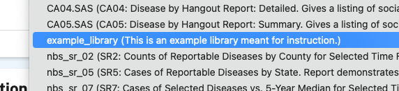
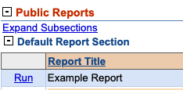
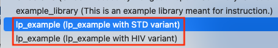

# Custom Python report libraries for NBS

## Table of contents

- [Introduction](#introduction)
- [Process overview](#process-overview)
- [Concepts](#concepts)
- [Writing a Python library](#writing-a-python-library)
  - [Function parameters for `execute`](#function-parameters-for-execute)
  - [Notable types](#notable-types)
- [Adding a custom library to NBS](#adding-a-custom-library-to-nbs)
  - [Adding a new Python library](#adding-a-new-python-library)
  - [Replacing an existing SAS library with Python](#replacing-an-existing-sas-library-with-python)
  - [Deploying custom Python libraries](#deploying-custom-python-libraries)
    - [Using a ConfigMap](#using-a-configmap)
- [Running the new report library](#running-the-new-report-library)
  - [Creating a report with the new Python library](#creating-a-report-with-the-new-python-library)
  - [Accessing a report that was updated from SAS to Python](#accessing-a-report-that-was-updated-from-sas-to-python)
- [Advanced topics](#advanced-topics)
  - [Library parameters](#library-parameters)

## Introduction

To allow STLTs to write custom report libraries, NBS 6 used the SAS statistical programming environment. NBS 7 replaces SAS with Python for running report libraries. The Python libraries in NBS 7 query existing databases and return results for viewing in the NBS 7 UI or to be exported to CSV files.

The Python libraries are executed in NBS 7 by the Report Execution service, which can be found in the `NEDSS-Modernization` repository: [NEDSS-Modernization](https://github.com/CDCgov/NEDSS-Modernization)

Within the repository, the Report Execution service is found at `apps/report-execution` and the Python library files are located at:

```
apps/report-execution/src/libraries        # builtin libraries
apps/report-execution/src/libraries/custom # Folder where STLT-made custom libraries are mounted
```

## Process overview

The following high-level process represents the general flow of writing and installing custom Python report libraries for NBS 7:

1. Write a Python library file following the contract outlined in the example in this document.
2. Register or update the Python library file in the `NBS_ODSE.dbo.Report_Library` table.
3. Deploy the `.py` report library file to the `report-execution` pod.
4. Create or run the report from the NBS UI.

The following sections describe each of these steps in detail.

## Concepts

- **report:** The main entity that runs individual report libraries using a configured data source in NBS.
- **report library:** The file where the actual data lookup and handling logic of the report lives. Previously written in SAS; now written in Python. In NBS 7, the report libraries are Python files that adhere to a prescribed shape for use in NBS by the Report Execution service.
- **library file:** A single Python file that adheres to a prescribed contract. The Report Execution service calls this file when a report runs and uses its result as the report's data.
- `Report_Library` **database table:** A table within the `NBS_ODSE` database that defines the individual report library files that reports can use.

## Writing a Python library

Here is a simple example of a Python library that returns unmodified data queried from a given data source:

```Python
from src.db_transaction import Transaction
from src.models import ReportResult, Table


def execute(
    trx: Transaction,
    subset_query: str,
    **kwargs,
) -> ReportResult:
    """Simple example of a Python report library."""

    content: Table = trx.query(subset_query)

    return ReportResult(content=content)
```
> **Note:** If you're looking for a more detailed example library, one is located [here](example_library.py) in this repository.  You may also reference the built-in libraries in the [NEDSS-Modernization](https://github.com/CDCgov/NEDSS-Modernization/tree/main/apps/report-execution/src/libraries) repository.

The primary contract that each Python library needs is the `execute` function. NBS calls this function when you run a report. NBS 7 cannot run a Python library file that does not have this method defined. The parameters are described in the following section.

### Function parameters for `execute`

The following table describes the required and optional parameters that are passed into this function.

| Parameter        | Type                              | Required? | Description                                                                                                                                                                                                                                                   |
|------------------|-----------------------------------|-----------|---------------------------------------------------------------------------------------------------------------------------------------------------------------------------------------------------------------------------------------------------------------|
| `trx`            | `Transaction`                     | yes       | Represents the database connection and has a method named `query` to execute SQL queries (results returned in a `Table` instance).                                                                                                                            |
| `subset_query`   | `str`                             | yes       | The SQL query NBS gives to the library. This is the main data source for the report. **NOTE:** all column selections, filters, and security permissions are baked into the query.                               |
| `sort_by`        | `str \| None`                     | no        | When an NBS user selects a column to sort their report, NBS passes this parameter in as a valid SQL string for use in an `ORDER BY` statement (such as `[Column Name] DESC`).                                                                            |
| `days_value`     | `int \| None`                     | no        | This is a built-in value for the `Duplicate Investigations Time Frame` report filter. If you are converting an existing SAS report that uses this specific report filter, NBS passes it in as this parameter.                                    |
| `column_map`     | `list[list[str]] \| None`         | no        | When specific columns are selected in the NBS run report UI, NBS builds this parameter from each column's `column name` (its actual SQL column name) and `column title` (the more human-friendly string describing the column) mapped to one another in a list. |
| `library_params` | `dict \| None` (parsed JSON string) | no        | Explained in the "Advanced Topics" section of this document.                                                                                                                                                                                                  |

> **Important**: Always include the `**kwargs` parameter in your custom library even if you are using all currently available named args. Future releases might add new arguments passed to the `execute` function, and this parameter ensures your library will continue to work as expected.

### Notable types

| Type           | Link                                                                                                                                                | Description                                                                                                                                                               |
|----------------|-----------------------------------------------------------------------------------------------------------------------------------------------------|---------------------------------------------------------------------------------------------------------------------------------------------------------------------------|
| `Transaction`  | [db_transaction.py](https://github.com/CDCgov/NEDSS-Modernization/blob/main/apps/report-execution/src/db_transaction.py) | Represents the database connection and has a method named `query` to execute SQL queries (results returned in a `Table` instance).                                        |
| `Table`        | [models.py](https://github.com/CDCgov/NEDSS-Modernization/blob/main/apps/report-execution/src/models.py)         | The data format that holds column names and data, used to return results to NBS.                                                                      |
| `ReportResult` | [models.py](https://github.com/CDCgov/NEDSS-Modernization/blob/main/apps/report-execution/src/models.py)        | The data shape that is used to return the resulting report data (via a `Table` instance, assigned to the `content` attribute) to either the NBS UI or the exported CSV. |

## Adding a custom library to NBS

There are two possible scenarios for adding a custom library to NBS 7:

- You have created [a brand new Python library](#adding-a-new-python-library) that has never been used before
- You have converted [an existing SAS library](#replacing-an-existing-sas-library-with-python) into Python and need to replace it

### Adding a new Python library

You must manually update the `NBS_ODSE.dbo.Report_Library` table to include information about a given custom report library. Use the following query as a template for this task:

```sql
USE [NBS_ODSE];

-- insert new Python report library
INSERT INTO [dbo].[Report_Library] (
    library_name,
    desc_txt,
    runner,
    column_select_ind,
    is_builtin_ind,
    add_time,
    add_user_id,
    last_chg_time,
    last_chg_user_id
) VALUES (
    'example_library',  -- MUST be the Python library's filename without ".py"
    'This is an example library meant for instruction.',  -- Short description of report library
    'python',  -- MUST have the value 'python'
    'N',  -- MUST be either 'Y' or 'N'. 'Y' means columns are selectable in the UI and the selected columns will be included in the `SELECT` statement in the base query. 'N' means users do not select columns in the UI and `SELECT *` is used in the base query instead.
    'N',  -- MUST be set to 'N' as any custom report you're writing will not be a builtin report library
    CURRENT_TIMESTAMP,
    99999999,  -- semi-standard system update value
    CURRENT_TIMESTAMP,
    99999999  -- semi-standard system update value
);
```

### Replacing an existing SAS library with Python

If you are replacing an existing SAS library with Python, then the SAS library should already be present in the `NBS_ODSE.dbo.Report_Library` table. Use the following query as a template to update the existing library to use the new Python library instead:

```sql
USE [NBS_ODSE];

-- ensure all reports using SAS libraries have up-to-date `library_uid` references
UPDATE [dbo].[Report]
SET
    library_uid = rl.library_uid
FROM [dbo].[Report_Library] rl
WHERE UPPER(rl.library_name) = UPPER(location);

-- update the existing SAS library to its Python equivalent
UPDATE [dbo].[Report_Library]
SET
    library_name = 'example_library',  -- MUST be the Python library's filename without ".py"
    runner = 'python',  -- MUST have the value 'python'
    desc_txt = 'This is an example library meant for instruction.',  -- Short description of library
    last_chg_time = CURRENT_TIMESTAMP,
    last_chg_user_id = 99999999  -- semi-standard system update value
WHERE
    UPPER(library_name) = 'EXISTING_LIBRARY.SAS';  -- MUST be the exact SAS library file name in ALL CAPS
```

Examples of completed SAS to Python translation queries are available in the [NEDSS-Modernization repo](https://github.com/CDCgov/NEDSS-Modernization/tree/main/apps/modernization-api/src/main/resources/db/report/execution/libraries).

### Deploying custom Python libraries

For custom Python libraries to work, you must include them when you deploy the `report-execution` service. Specifically, you must place all custom report library files in the following directory of the `report-execution` pod:

```
/usr/report-execution/src/libraries/custom/
```

> **Important:** To mount the files in this location, you must provision storage as part of the Helm/k8s installation of `report-execution`.

#### Using a ConfigMap

One way to do this is through the use of a [k8s ConfigMap](https://kubernetes.io/docs/concepts/configuration/configmap/). You can use the `ConfigMap` to store individual Python library files as binary data in the form of base64 strings.

The following example uses the [NEDSS-Helm](https://github.com/CDCgov/NEDSS-Helm/) repository and adds configuration to the `modernization-api` Helm chart. The example `ConfigMap` takes in all Python files from a specific directory and stores them as binary data:

```yaml
# charts/modernization-api/templates/configmap-report-execution.yaml

{{- if eq (toString .Values.reportExecution.enabled) "true" }}
apiVersion: v1
kind: ConfigMap
metadata:
  name: {{ include "modernization-api.reportExecution.fullname" . }}-configmap
binaryData:
  {{- (.Files.Glob "custom-libs/*.py").AsSecrets | nindent 2 }}
{{- end }}
```

In this example, all Python files from the `charts/modernization-api/custom-libs` directory are retrieved. Stage whichever Python libraries you want to install in that directory, and Helm builds the `ConfigMap`. You can use any directory that is convenient for your scenario.

The generated k8s `ConfigMap` YAML will look similar to the following, with each filename as a key and the contents of the Python file as a base64 encoded string:

```yaml
apiVersion: v1
kind: ConfigMap
metadata:
  name: release-name-modernization-api-report-execution-configmap
binaryData:
  example_library.py: # base64 encoded string here ...
```

When mounted, Kubernetes decodes each `ConfigMap` entry back to the original plaintext Python file, using the key as the filename.

You then add the `ConfigMap` to the `report-execution` deployment Helm YAML:

  > **Important:** This is a partial YAML file for demonstration and should not be used directly.

```yaml
# charts/modernization-api/templates/deployment-report-execution.yaml

spec:
  # ...
  template:
    # ...
    spec:
      # ...
      containers:
        - name: report-execution
          # ...
          volumeMounts:
          - mountPath: {{ .Values.reportExecution.customLibPath }}
            name: {{ include "modernization-api.reportExecution.fullname" . }}-configmap
            readOnly: true
      volumes:
        - name: {{ include "modernization-api.reportExecution.fullname" . }}-configmap
          configMap:
            name: {{ include "modernization-api.reportExecution.fullname" . }}-configmap
            defaultMode: 0777
      # ...
```

The value of `mountPath` within the `volumeMounts` section is defined in the Helm values YAML file for the `modernization-api` chart:

  > **Important:** This is a partial YAML file for demonstration and should not be used directly.

```yaml
# charts/modernization-api/values.yaml

# ...
reportExecution:
  # ...
  customLibPath: /usr/report-execution/src/libraries/custom/
```

## Running the new report library

Before running the new library from the NBS UI, confirm that you have completed the following:

- Written the Python library
- Updated the database to register the new Python library
- Deployed the Python library to the Report Execution service

Use one of the following methods to run a report with the new library:

- If you are running a brand new report library, [create a new report in the NBS UI](#creating-a-report-with-the-new-python-library).
- If you have replaced an existing SAS library with the new Python library, [run the existing report from the NBS UI](#accessing-a-report-that-was-updated-from-sas-to-python).

### Creating a report with the new Python library

Once you have added the new Python library to NBS, create a new report:

1. Log in to NBS as a user with **Report Management** permission.
2. Navigate to **System Management** > **Report Management**, then select **Manage Reports**.
3. Select **Create**.
4. Fill out the **Add report** configuration screen.
5. Find the new custom Python library in the **Report execution library** dropdown.

   > **Note:** If the library does not appear in the dropdown, clear your browser's local storage. The dropdown values are cached there.

   The `Report execution library` dropdown lists available Python report libraries by name, as shown in the following image:

   

   A completed report configuration using a custom Python library looks like this:

   

6. Select **Submit**.
7. Navigate to **Reports**.

   The new report appears in the group and section you configured:

   

### Accessing a report that was updated from SAS to Python

After you deploy the new Python library to NBS and update the database table, the existing report appears in the same spot in the Reports section, now backed by the Python library instead of SAS.

Run the report the same way as before. It now uses the modernized run UI and the Python library that you configured.

## Advanced topics

### Library parameters

A single Python report library can handle two or more distinct scenarios. For example, a report library might calculate STD data and HIV data separately. The `library_params` mechanism lets you configure NBS to run the same report library separately for each scenario, rather than writing a separate library for each one. The built-in libraries `pa_01`, `pa_02`, `pa_04`, `qa_07`, and the TB reports already use this mechanism.

To create a variant, add a row to the `NBS_ODSE.dbo.Report_Library` table with the same `library_name` and a JSON object in the `library_params` column. NBS passes this JSON object into the report library as a Python dictionary. For example, you could set `library_params` to `'{"report_variant": "STD"}'` for one row and `'{"report_variant": "HIV"}'` for another.

> **Important:** All users with access to the Reports module can view the description for each variant in the NBS application, so make sure the `description` value is accurate and clearly distinguishes the variant.

The following partial SQL statements set up the two variants from this example in the database:

```sql
USE [NBS_ODSE];

-- STD variant
INSERT INTO [dbo].[Report_Library] (
    library_name,
    desc_txt,
    library_params,
    -- ... incomplete for brevity
) VALUES (
    'lp_example',  -- MUST be the Python library's filename without ".py"
    'lp_example with STD variant', -- be sure this is descriptive to what is present in `library_params`!
    '{"report_variant": "STD"}' -- MUST be valid JSON
    -- ... incomplete for brevity
);

-- HIV variant
INSERT INTO [dbo].[Report_Library] (
    library_name,
    desc_txt,
    library_params,
    -- ... incomplete for brevity
) VALUES (
    'lp_example',  -- MUST be the Python library's filename without ".py"
    'lp_example with HIV variant', -- be sure this is descriptive to what is present in `library_params`!
    '{"report_variant": "HIV"}' -- MUST be valid JSON
    -- ... incomplete for brevity
);

```

Once you add the variants to the database, you can select each in the **Report execution library** dropdown on the **Add report** screen:



The library runner in the Report Execution service is set up to pass in any value it finds in the `library_params` column to the `execute` method as a parameter named `library_params`. The value is converted from a JSON string to a Python dictionary at runtime.

As an example, you could set up your report library to be similar to the following:

```Python
from src.db_transaction import Transaction
from src.models import ReportResult, Table


def execute(
    trx: Transaction,
    subset_query: str,
    library_params: dict,
    **kwargs,
) -> ReportResult:
    """An example of using `library_params` in your report library."""

    content: Table = trx.query(subset_query)

    report_variant: str = library_params.get('report_variant')

    if report_variant == 'STD':
        # handle STD logic
    elif report_variant == 'HIV':
        # handle HIV logic

    # ...
```

The report library's `execute` function can branch its logic based on the values in the `library_params` dictionary.
